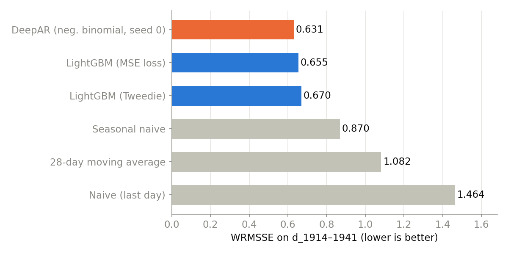
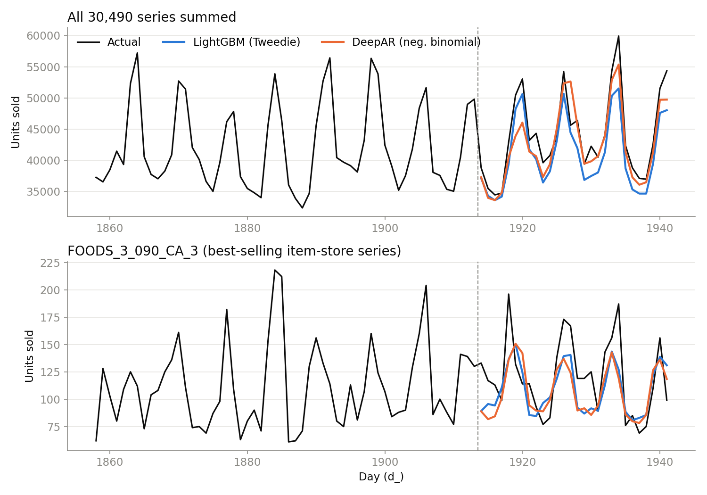
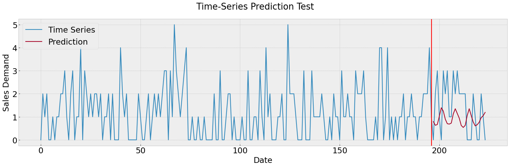

# M5 Demand Forecasting: From a Per-Item Transformer to Global Models

UC Berkeley capstone (2023–2024) on deep-learning forecasting for the **M5 Walmart sales** dataset
(30,490 item-store series), plus a 2026 follow-up that re-evaluated the work properly and fixed what didn't hold up.

> This is a personal, cleaned-up copy of a team project. The original team repository, with its full commit history,
> is [miloscola/Capsrone23-DeepAR](https://github.com/miloscola/Capsrone23-DeepAR). See [Team & credits](#team--credits).

**TL;DR**
- The capstone's headline model, a Transformer pretrained on related items and fine-tuned on one item, **did not beat a
  28-day moving average** on that item (RMSE 1.24 vs 1.08). It was also only ever evaluated on that single item.
- The follow-up evaluates every model on **all 30,490 series with the official M5 metric (WRMSSE)**, against simple
  baselines. There, **global models** (one model trained across all series) beat seasonal naive by **23–27%**.
- A global **DeepAR** (LSTM), the **capstone Transformer with its bugs fixed** and trained globally, and a global
  **LightGBM** all end up roughly tied (0.63–0.67). Attention did not beat the LSTM or the trees here.



## Results

Test period: d_1914–1941 (28 days, the M5 public-leaderboard window). Validation: the 28 days before it.
Lower is better; WRMSSE averages 12 aggregation levels, from total sales down to individual item-store series.

| Model | Valid WRMSSE | Test WRMSSE | vs. seasonal naive (test) |
|---|---|---|---|
| **DeepAR, negative binomial** (seed 0 / seed 1) | 0.545 / – | **0.632 / 0.662** | −27% / −24% |
| **Transformer, fixed and global** | 0.574 | **0.650** | −25% |
| **LightGBM, MSE loss** | 0.532 | **0.655** | −25% |
| **LightGBM, Tweedie loss** | 0.520 | **0.671** | −23% |
| Seasonal naive (repeat last week) | 0.923 | 0.870 | – |
| 28-day moving average | 1.098 | 1.082 | +24% |
| Naive (repeat last day) | 1.486 | 1.464 | +68% |

Full per-level scores are in [`results/metrics.csv`](results/metrics.csv). As a sanity check on the metric
implementation, the naive and seasonal-naive scores match the values commonly reported for this window.



**What the numbers say**
- **Global training is what matters, not the architecture.** All three global models are far ahead of the
  baselines, and the spread between them (0.63–0.67) is about the same size as DeepAR's seed-to-seed variation
  (0.632 vs 0.662). The fixed Transformer (attention over time) lands in the middle of that band.
- **The loss function mattered less than expected.** Tweedie is the textbook choice for zero-heavy counts, but LightGBM
  with plain MSE did slightly better on test (0.655 vs 0.671) and slightly worse on validation. Loss was not the main problem.
- **On a single high-volume series, the gain is small.** For the best seller (bottom panel above), both models
  track the weekly cycle but are roughly level with seasonal naive (RMSE 26.8 LightGBM, 27.9 Transformer, 28.4 DeepAR,
  26.6 seasonal naive, 35.6 moving average). The advantage comes from being consistently good across all 30,490 series.
- **One sparse item can't rank models.** On the capstone's example item, every model forecasts roughly the item's
  average level:

  | Model, on `HOBBIES_1_005_CA_1`, d_1914–1941 | RMSE |
  |---|---|
  | 28-day moving average | 1.08 |
  | DeepAR, negative binomial (global) | 1.13 |
  | Transformer, fixed (global) | 1.13 |
  | LightGBM, Tweedie (global) | 1.15 |
  | Transformer, pretrained + fine-tuned (capstone) | 1.24 |
  | Seasonal naive | 1.66 |

  A series that sells 0–5 units a day, 29% of them zero, is mostly noise over 28 days. The global models' advantage
  shows up in aggregate: they get the weekly cycle and overall level right across thousands of series.

## Capstone goal, and whether it was met

The team's stated objective was to *"apply different time-series models and compare their pros and cons for predicting
future retail demand"* on M5, comparing DeepAR (LSTM-based), a Transformer, and Transformer variants. The original
report concluded the Transformer was clearly superior. With proper evaluation, that conclusion did not hold.

| Part of the goal | Met? | Notes |
|---|---|---|
| Compare model families fairly | ✅ | Same training setup (global), same inputs, same test window, same metric, with baselines |
| Forecast retail demand accurately | ✅ mostly | ~25% better than seasonal naive on WRMSSE; solid, though not competition-level (top M5 entries used large tuned ensembles) |
| Identify each model's pros and cons | ⚠️ partly | Accuracy is compared rigorously (the models tie); cost, interpretability, and probabilistic accuracy are not yet compared side by side |
| Show business value | ❌ not yet | Forecast error is measured, but not its effect on stockouts or inventory cost |

## What went wrong in the capstone, and what changed

| Capstone (2024) | Follow-up (2026) |
|---|---|
| A separate model for each item | One model trained on all 30,490 series |
| Judged on one item | Scored on all series with the official M5 metric |
| No baselines | Compared against simple baselines |
| No validation set | Tuned on validation, test used once |

**Why the capstone Transformer gave a flat line:** it had three bugs.
1. Attention compared different samples in the batch instead of different days.
2. The forecast was made from the oldest day instead of the most recent one.
3. Most of the training effort went into copying the input, not forecasting.

So the model couldn't see recent sales and just predicted the average. The fixed version is in `m5/transformer.py`.

<details>
<summary>Technical details: the Transformer bugs, and what it took to get DeepAR working</summary>

**Transformer bugs (notebooks 03–07)**
- `nn.TransformerEncoderLayer` used its default `batch_first=False` with `(batch, time, features)` inputs, so
  attention ran over the batch axis and the positional encoding was indexed by batch position.
- `self.decoder(x[:, -196, :])` decoded from index −196 of a 196-day window, i.e. the oldest day.
- The model output 224 values (196 input days + 28 forecasts) and the MSE loss covered all of them.

**DeepAR fixes.** The first global DeepAR scored 2.47, worse than naive.
- A price outlier (a 897× week-over-week ratio): now a log ratio clipped to ±1.
- Only yesterday's sales as input: added lags 1/7/14/28, as in the DeepAR paper.
- Scaling: inputs are divided by `mean + 1`; the output is `mean × multiplier + small extra term`.
- PyTorch 2.2 on Apple MPS returned wrong LSTM outputs for large batches: forecast batches are capped at 512 rows,
  and results were produced on PyTorch 2.14.

</details>

## Next steps

1. **Test on more time periods.** Results come from a single 28-day window.
2. **Score the uncertainty forecasts.** DeepAR and the Transformer predict ranges, but only their averages are scored.
3. **Compare speed and cost.** LightGBM trains in minutes on CPU; the Transformer needs about an hour on GPU.
4. **Combine the three models.** Averaging them is easy and often more accurate.
5. **Measure business impact.** Estimate how many stockouts and how much overstock the better forecasts would avoid.

## Repository layout

```
.
├── m5/                          follow-up: shared code
│   ├── data.py                  loading, validation/test splits
│   ├── wrmsse.py                official M5 metric over all 12 aggregation levels
│   ├── features.py              LightGBM features (every sales feature lagged ≥ 28 days → direct 28-day forecast)
│   ├── deepar_nb.py             global DeepAR with a negative-binomial likelihood
│   ├── transformer.py           the capstone Transformer, fixed: attention over time, direct 28-day NB forecast
│   └── results.py               saves forecasts, appends scores to results/metrics.csv
├── scripts/
│   ├── baselines.py             naive, seasonal naive, moving average
│   ├── lgbm.py                  global LightGBM (--loss tweedie | l2)
│   ├── deepar_global.py         train + sample-based forecast for DeepAR
│   ├── transformer_global.py    train + direct forecast for the Transformer
│   └── plots.py                 README figures and the single-item table
├── results/metrics.csv          every score in this README
├── deepar/                      capstone: DeepAR code adapted from zhykoties/TimeSeries (Gaussian likelihood)
├── notebooks/                   capstone: EDA, LSTM baseline, Transformer + pretrain/fine-tune experiments
├── data/                        datasets (not committed, see data/README.md)
└── assets/                      figures used in this README
```

## Reproducing the results

```bash
python -m venv .venv && source .venv/bin/activate
pip install -r requirements.txt
# download M5 into data/M5/ (see data/README.md)

export PYTHONPATH=.
python scripts/baselines.py                              # ~15 s
python scripts/lgbm.py --loss tweedie                    # 10–20 min on 10 CPU cores
python scripts/lgbm.py --loss l2
python scripts/deepar_global.py --split valid            # ~15 min on an M2 Pro (MPS)
python scripts/deepar_global.py --split test
python scripts/transformer_global.py --split valid       # ~1 h on an M2 Pro (MPS)
python scripts/transformer_global.py --split test
python scripts/plots.py
```

Every script appends its scores to `results/metrics.csv`.

## The original capstone

We started by reproducing **DeepAR** ([Salinas et al., 2017](https://arxiv.org/abs/1704.04110)) on the UCI electricity
dataset. Then we adapted it to M5 and compared it with a per-item **LSTM** baseline and a **Transformer** encoder
(196-day input window, 28-day output). The Transformer experiments covered normalization variants, 8 vs 16 attention
heads, and pretraining on the same item across 4 California stores before fine-tuning on the target item.


*The capstone's pretrained + fine-tuned Transformer on `HOBBIES_1_005_CA_1`. It captures the average level but none
of the spikes, and scores worse than a moving average. See "Why the capstone Transformer gave a flat line" above.*

| Notebook | Contents |
|---|---|
| `01_m5_eda.ipynb` | exploratory data analysis |
| `02_m5_lstm_baseline.ipynb` | per-item LSTM |
| `03`–`04` | Transformer encoder, with and without per-window normalization |
| `05_m5_transformer_pretrain.ipynb` | pretraining on related series |
| `06`–`07` | fine-tuning on the target item (8 / 16 heads) |
| `08_m5_transformer_vs_lstm_kaggle.ipynb` | Transformer vs LSTM, adapted from a Kaggle notebook |
| `variants/`, `exploration/` | alternative settings and early drafts |

The capstone code under `deepar/` was written for PyTorch 0.4.1 and hasn't been re-tested on current versions.
Notebooks in `exploration/` may depend on intermediate files written by other drafts.

## Team & credits

- **Vivian Fang** ([@FCWVivian](https://github.com/FCWVivian)): M5 preprocessing and data loader, LSTM baseline,
  Transformer models, pretraining / fine-tuning experiments, EDA; the 2026 follow-up
- **[@miloscola](https://github.com/miloscola)**: set up the team repo, DeepAR training/evaluation loop,
  normalization (batch-norm) experiments
- **Gululu**: DeepAR testing
- UC Berkeley Capstone 2023–2024

The capstone's DeepAR implementation is based on
[zhykoties/TimeSeries](https://github.com/zhykoties/TimeSeries) by Yunkai Zhang, Qiao Jiang, and Xueying Ma
(Apache-2.0). Some M5 notebooks adapt ideas from public Kaggle notebooks
([davidnguyens16](https://www.kaggle.com/code/davidnguyens16/learning-pytorch-lstm-deep-learning-with-m5-data),
[anshuls235](https://www.kaggle.com/code/anshuls235/time-series-forecasting-eda-fe-modelling)).

## License

Apache License 2.0 (inherited from the upstream DeepAR implementation). See [LICENSE](LICENSE).
